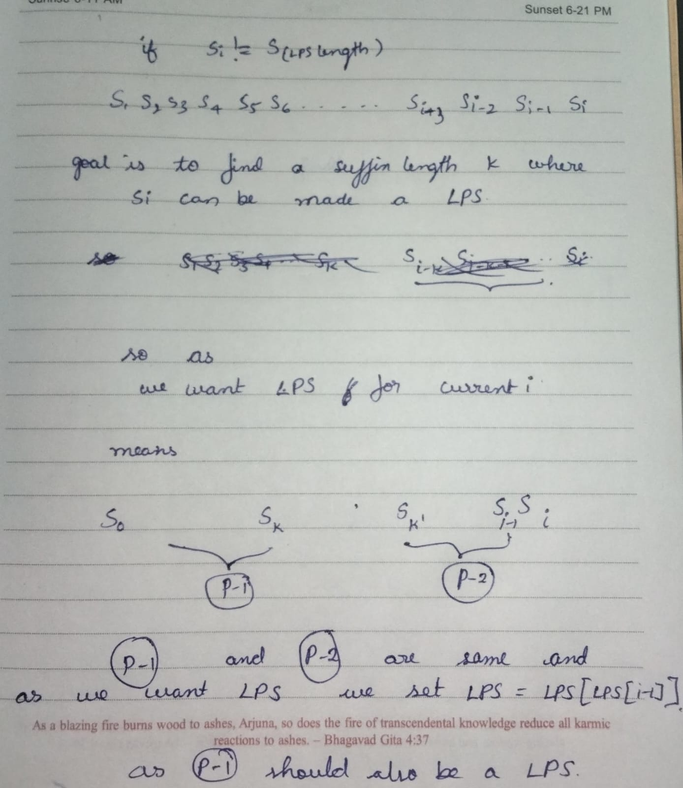

The Requirement here is to find if pattern is in the Given String :: 
example :  "cdababab"  is given and to find out if "abab" is present in it or not 

The naive or brute force will be :
i = 0 , j = 0

for each index from i = 0 to i = somelength(given.length - patt.length) n check if it is matching from j = 0 to j = patt.length of patt's characters

so consider this example  "aaaaaaaaaaBaaaaaaaaaaaaaa" and  checking for some pattern "aaaaaaaaaaaaa" 
here in the brute force , starting from i = 0 and stop at 'B' and do this for every i next and repeat this process TC will be O(n^2) 

here in KMP : skips some caluculations :: By constructing LPS this table can help , here by directly jumping to pointer or index to check
: consider the above example with more repeating characters 'a' : here LPS array looks like this (LPS is constructed on pattern string) Longest proper prefix suffix array::  [0,1,2,3,4,5,6,7,8,9,10,11,12]

dry run :  start i = 0 , j = 0 and start checking it will stop at 'B' and i = 0 and j = 1 (i - patt and j - given String) and start the process again :: but using KMP we jump i to LPS[i-1] 
and next check starts from current i(LPS[i-1]) and j  

So in notations previously  doing it in O(n^2) and now consider  at a index j at given string then  move i from a certain index i'(lps[i-1])  to 0 :
here to explain this complexity while the pattern matching length 'i' as it increases we may have to check for more indexes back 

consider : we are at a index j = m then we may check for m points so (n/m)*2m == 2*n   
if we consider some k where k = n/m and k times if j moves m times then it will be in complexity of O(n) ~ to O(m+n) 

Now LPS construction 

**** IN LPS or MAIN KMP ALGO no of steps directly proportional to Math.min(patt.length , steps)  so TC will be O(2*M) for LPS construction , O(M+N) for KMP ***** 
consider s0s1s2s3s4s5s6s7 as pattern 

****Main LOGIC For KMP****
- We find (LPS ::-) Longest prefix for current Suffix : example is consider : "aacecaaaa" (012345678)
- array will be like this LPS array : [0,1,0,0,0,1,2,2,2]
- This table gives us characters to skip matching which will match already when u start checking from first index
- i.e we are checking for match for the above pattern String in some String(EX) and the EX is matching till **6th** index and usually in brute force we start from beginning here but as we know that in our current matched String till now the first 2 characters **(lps[6] = 2 )** we start checking from 2nd index in our pattern this helps us reduce the time complexity and also we don't need to check from the beg of EX String again  **fun algorithm (my ass)**  
- why are we not checking from start here is because if there was a match before then we wouldn't be here ***(SMH+ass check this in future)**

-[Shortest Palindrome] : (https://leetcode.com/problems/shortest-palindrome/description/) 
-[rotated Strings or not] : (https://www.geeksforgeeks.org/problems/check-if-strings-are-rotations-of-each-other-or-not-1587115620/1)

